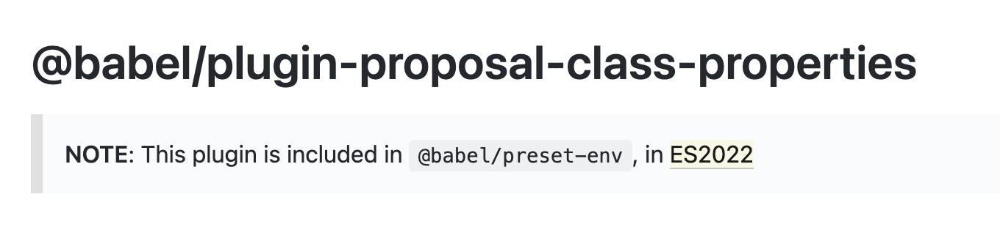

# 49장 Babel과 Webpack을 이용한 ES6+/ES.NEXT 개발 환경 구축
- 대부분의 브라우저에서는 ES6사양을 지원한다.
- 하지만 IE11의 ES6 지원율은 11%이며 구형 브라우저에서는 지원율이 제각각이다.
-
## 49.1 Babel
- ES6+/ES.NEXT로 구현된 최신 사양의 소스코드를 IE 같은 구형 브라우저에서도 동작하는 ES5 사양의 소스코드로 변환(트랜스파일링) 해준다.
```jsx
//ES6(화살표 함수, 지수 연산자)
[1,2,3].map(n => n ** n);

//ES5
[1,2,3].map(function(n){
    return Math.pow(n,n)
})
```

### 49.1.1 Babel 설치
```markdown
# 프로젝트 폴더 생성
$ mkdir esnext-project && cd esnext-project

# package.json 생성
$ npm init -y

# babel-core, babel-cli 설치
$ npm install @babel/core @babel/cli

# 버전 지정 설치
npm install --save-dev @babel/core@7.10.3 @babel/cli@7.10.3 
```

#### 49.1.2 Babel 프리셋 설치와 babel.config.json 설정 파일 작성
- Babel 프리셋 : @babel/preset-env, 함께 사용되어야 하는 Babel 플러그인을 모아 둔 것.
- Babel이 제공하는 공식 Babel 프리셋은 다음과 같다.
```markdown
- @babel/preset-env
- @babel/preset-flow
- @babel/preset-react
- @babel/preset-typescript
```
- 프로젝트 지원 환경은 BrowSerslist 형식으로 .browserslistrc 파일에 상세히 설정할 수 있다.
```markdown
# @babel/preset-env 설치
$ npm install --save-dev @babel/preset-env

```
- package.json
```json
{
  "name": "esnext-project",
  "version": "1.0.0",
  "dependencies": {
    "@babel/cli": "^7.17.6",
    "@babel/core": "^7.17.9",
    "@babel/preset-env": "^7.16.11"
  }
}
```
- 프리셋 설치 후 babel.config.json에서 설정할 수 있다.
```json
{
  "presets" : ["@babel/preset-env"]
}
```

### 49.1.3 트랜스파일링
- 트랜스파일링을 할 때 npm scripts에 Babel CLI 명령어를 등록하여 사용할 수 있다.
- package.json
```json
{
  "name": "esnext-project",
  "version": "1.0.0",
  "scripts" : {
    "build" : "babel src/js -w -d dist/js"
  },
  "dependencies": {
    "@babel/cli": "^7.17.6",
    "@babel/core": "^7.17.9",
    "@babel/preset-env": "^7.16.11"
  }
}
```
- src/js(타깃 폴더)에 있는 모든 자바스크립트 파일들을 트랜스파일링한 후 그 결과물을 dist/js 폴더에 저장한다.
- -w : --watch, 타깃 폴더에 있는 모드 js 파일들의 변경을 감지하여 자동으로 트랜스파일한다.
- -d : --out-dir, 트랜스파일링된 결과물이 저장될 폴더를 지정. 지정된 폴더가 없을시 자동 생성한다.

- 예제 파일 만든 후 npm run build
- 정상적으로 트랜스파일링 되었다.
### 49.1.4 Babel 플러그인 설치
- 현재 preset-env에서는 아래 플러그인을 지원하고 있었다.
<p align="center"></p>

- 필요한 플러그인을 설치
```
$ npm install --save-dev @babel/plugin-proposal-class-properties
```
- babel.config.json 설정 파일에 추가
```
{
  "presets": ["@babel/preset-env"],
  "plugins": ["babel/plugin-proposal-class-properties"]
}

```

- main.js를 실행.
```
$ node dist/js/main

3.141592653589793
36.4621596072079
{ a: 1, b: 2, x: { c: 3, d: 4 } }
10
```
- 플러그인을 설치했다면 babel.config.json 설정 파일에 추가해야 한다.
### 49.1.5 브라우저에서 모듈 로딩 테스트
- 위 예제의 모듈 기능은 Node.js 환경에서 동작한 것이고 Babel이 모듈을 트랜스파일링한 것도 Node.js가 기본 지원하는 CommonJS 방식의 모듈 로딩 시스템에 따른 것이다.
```jsx
"use strict";

var _lib = require("./lib");

console.log(_lib.pi);
console.log((0, _lib.power)(_lib.pi, _lib.pi));
var f = new _lib.Foo();
console.log(f.foo());
console.log(f.bar());
```

- 브라우저는 CommonJS 방식의 require 함수를 지원하지 않으므로 브라우저에서 실행시 에러가 발생한다.
- 이러한 문제는 Webpack을 통해 해결할 수 있다.
